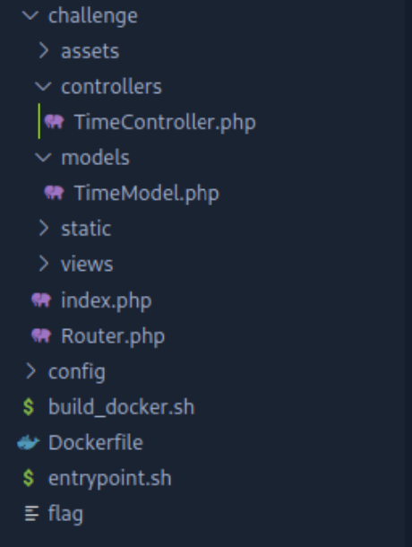

# Lovetok Writeup (Hack the Box Web Challenge)

## Cateogory: PHP Sanitization Bypass

## Context

Dockerized container of a Hack the Box challenge using:

`172.17.0.1:1337` to serve an HTTP webpage.

## Getting Started

Lovetok appears to be a website that predicts when you will fall in love?
Pretty stupid if you ask me.

The first thing that I notice is that there is a URL query happening for a 
"format" variable.

Looking at the source code as soon as possible is not the path I like to take...

Let's play with it.

Putting `test` into the query we see that it changes the look of the time output.

If this query box is able to change what is on the webpage, then there has to be
some kind of function that this variable is being passed into to create a format string.
... Potentially using a vulnerable function that will allow us to get remote code execution
(!!!)

To the source code!

There immediately are two `.php` files that stick out to me:

1. `TimeController.php`
2. `TimeModel.php`

Just because I can, let's look at `TimeController.php` first.

So this is where the variable `format` is taken once the user makes a `GET` request.

Line 6 is setting `$format` by checking if it's blank, set it to `r` and if it's
filled, set it to the user input. Nothing too abnormal yet...

Line 7 is creating a new `TimeModel` object with the `$format` variable being passed
through.

Let's follow the money...

Looking at the `constructor` function, we see that is uses the `addslashes()` function
from PHP to *probably* sanitize the input. To be real, I don't know what it does.

TO THE INTERNET!

I guess simply put, it puts an escape character before:

1. Single Quotes `'`
2. Double Quotes `"`
3. Backslashes `\`
4. NULL Bytes `NUL`

So it's sanitizing it by removing quotes... okay... Maybe that will hinder an RCE, but let's press.

Looking back at `TimeController.php`, we see that it then uses the `getTime()` function fromt the
`TimeMode` class.

Analyzing that section, we see that it uses the `eval()` function... AND ITS PASSING `$format` INTO IT! Jackpot?

The `$format` variable is enclosed in `""` which means we can't end the line early and inject our own code there and comment out the rest of the line like easier `PHP` challenges. Darn.

It took me a bit, but why couldn't we define a variable inside the `$format` variable that would execute a command to find `$format`? Little confusing, but IMAGES!

If we set `$format` to a variable: `?format=${[PHP INJECTION]}` then I think we might have something...

Using `phpinfo()` let's check if this RCE works.

Judging by the huge PHP logo on the front of the webpage, I think it was a success.

Awesome, let's just get in and `cat` the flag and head out.

Until... I remembered I can't use quotes...

We can use the `ls` command inside `system()` to see what we are looking at, but I kinda already knew that since we got the soure code.

So how do you get the root directory without quotes? It took me a while of research and looking into different ways to bypass. Turns out, `_GET` is a dictionary!

What if we add to that dictionary, call it again with a new entry that allows us to have a space in the command without having to surround it in quotes?

To the drawing? code board? Who knows.

The theory goes that if we make the `$format` variable `system($_GET[something])` then we can pass an extra variable through without using quotes.

`http://172.17.0.1:1337/?format=${system($_GET[something])}&something=[insert command here]`

Testin` time? (Kinda like morphing time? Power rangers? Cyber rangers?)

Success! Now let's get that flag!

Note: You have to URL encode any special URL characters.

One command away from pwn

## Solution

Payload:
`http://172.17.0.1:1337/?format=${system($_GET[something])}&something=cat+flagUw3CX`

And proving it on official HTB VPN:

# Lessons Learned

1. What `addslashes()` does
2. Ability to call `_GET[]` and just tack on extra inputs
3. Bypassing `""` with `$_GET[]` instead.