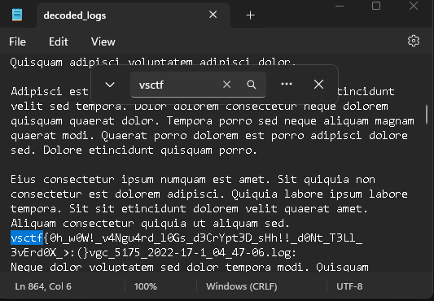

# Canguard - vsctf 2023

> Challenge created by: Neil

The user of this PC was caught cheating on Valorant, can you figure out why his cheat was detected?

### 1. Unzip *.ad1 file

I used the 7zForensics plugin for 7z to unpack the forensic file.

### 2. Find Riot Game's VANGUARD log folder

`/Program Files/Riot Vanguard/Logs/`

### 3. Decode VANGUARD's logs

I borrowed a script found [here](https://www.unknowncheats.me/forum/anti-cheat-bypass/488665-vanguard-log-decryptor.html).

Here is the modified script.

```python
import struct
import sys
import os
    
def rc4(data, key):
    S = [i for i in range(256)]
    j = 0
    out = []
    for i in range(256):
        j = (j + S[i] + key[i % len(key)]) % 256
        S[i], S[j] = S[j], S[i]
    i = j = 0
    for char in data:
        i = (i + 1) % 256
        j = (j + S[i]) % 256
        S[i], S[j] = S[j], S[i]
        out.append(char ^ S[(S[i] + S[j]) % 256])
    return bytearray(out)
    
    
KEYMASK = [0xB1, 0x54, 0x45, 0x57, 0xA7, 0xC4, 0x64, 0x2E,
            0x98, 0xD8, 0xB1, 0x1A, 0x0B, 0xAA, 0xD8, 0x8E,
            0x7F, 0x1E, 0x5B, 0x8D, 0x08, 0x67, 0x96, 0xCB,
            0xAA, 0x11, 0x50, 0x84, 0x17, 0x46, 0xA3, 0x30]
    
# if len(sys.argv) <= 1:
#     print('usage: script.py vgc_X_Y_Z.log')
#     exit()
LISTLOG = open("decoded_logs.log", "w")
for j in os.listdir():
    if j[:3] == "vgk" or j[:3] == "vgc":
        DATA = open(j, 'rb').read()
        LISTLOG.write(f"{j}:\n")
        DATA = DATA[4:]
        REAL_KEY = [DATA[i] ^ KEYMASK[i] for i in range(32)]
        DATA = DATA[32:]
        while len(DATA) > 0:
            BLOCK_LEN = struct.unpack('<L', DATA[:4])[0]
            DATA = DATA[4:]
            LISTLOG.write(rc4(DATA[:BLOCK_LEN], REAL_KEY).decode('utf-16'))
            print(rc4(DATA[:BLOCK_LEN], REAL_KEY).decode('utf-16'))
            DATA = DATA[BLOCK_LEN:]
```

A quick ctrl+F of the output file and we find the flag :)

