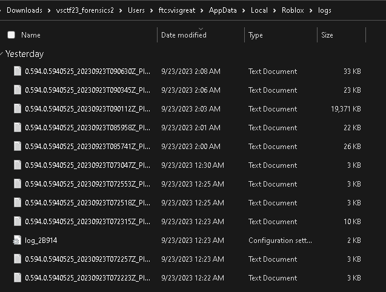
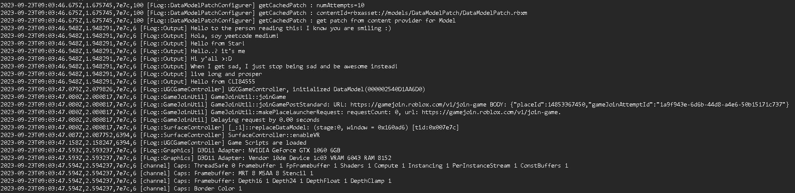
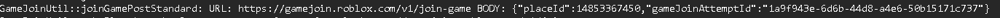
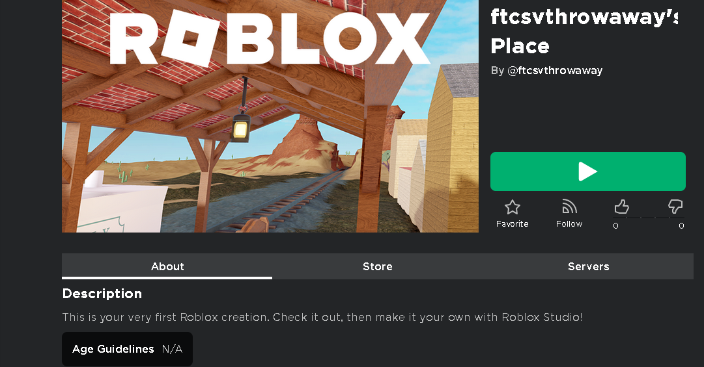
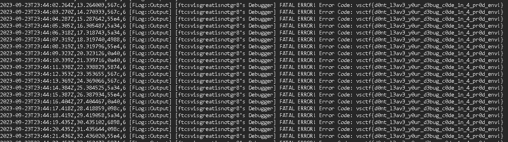

# RoRansom1 - vsctf 2023

> Challenge created by: Neil

The user of this computer was tricked into joining a weird Roblox game. We suspect a newbie hacker used a fake account to host the malicious game. There might be some leftover code in the game (due to the hackers incompetency) that can help us find out who they really are.

## Overview

I found this challenge to be an interesting twist on such a popular children's platform. Having developed ROBLOX games, this challenge took me back and made me realize just how much I remembered about the platform.

### 1. Unzip *.ad1 file

I used the 7zForensics plugin for 7z to unpack the forensic file.

### 2. Find User Join Logs

To find the User logs, you have to find where the logs are generated.

`/Users/ftcsvisgreat/AppData/Local/Roblox/logs/`

Now we're in the logs but... what do they mean...

### 3. Reading Logs

A little more background for what these logs actually are...

These logs are logging important information that ROBLOX is using to connect you to the "experience" (whatever game you are playing) and the internal logs of the Roblox application.

Looking at this quick segment, we can see what `PlaceID` they joined, their `UserId` and other information that reveals their activities.

Looking back to the question again, 
> "... tricked into joining a weird Roblox game."

Let's look at what games they played!

### 4. Finding the Game

Looking back at the previous step, we found the `PlaceId` that we can use to find the ROBLOX game.

Conviently, you can easily find the place by going to ROBLOX and just asking!

`www.roblox.com/games/{PLACEID}`

And we found the place! Now... how do we find their true identity

### 5. Finding the Account's Identity

We haven't found a flag yet and the throwaway account does not count for the flag. After a long time of fiddling with a bunch of different mecahnics in ROBLOX as well as looking extensively through the given file directory, I joined the game and read the logs that got read out to me.

Joining the game and finding my own logs, it looks like the hacker left in their debugger.

Solved!
