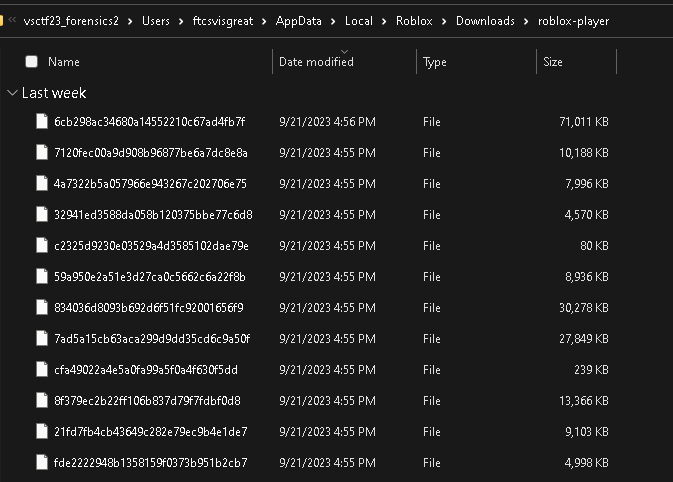
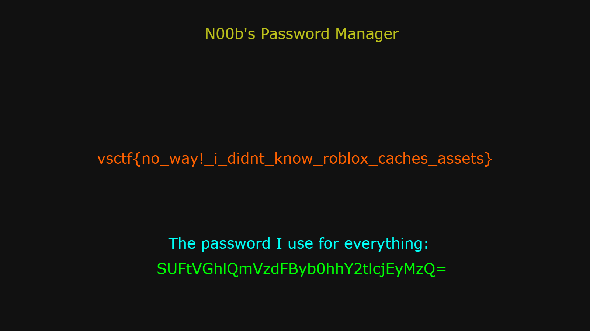

# RoRansom2 - vsctf 2023

> Challenge created by: Neil

Intelligence informs us that the hacker has horrible memory, so they hid an asset in the game which has his passwords, and as far as we know, he has removed it from the game. Recover the asset.

## Overview

This challenge was exciting because we delved deep into how ROBLOX stores and archives deleted assets from your games.

### 1. Unzip *.ad1 file

I used the 7zForensics plugin for 7z to unpack the forensic file.

### 2. Finding Archived Assets

To find this, I did a lot of directory traversal and testing to find where all these assets are stored. I knew that they wouldn't just be stored out in the open, but I was wrong. They are just stored in archive files that 7zip can easily decompress.

`/Users/ftcsvisgreat/AppData/Local/Roblox/Downloads/roblox-player/`

### 3. Extracting Assets

Ctrl + A

Menu -> 7zip -> Extract

:)

### 4. Finding the Password

After unarhciving the entire directory, it explodes with different assets that the User was visiting. Including images, sound files, ROBLOX model files, ROBLOX studio files, etc.

One of the files that quickly caught my eye was `pswmgr.png`..

Opening and we find the flag :)

Solved!
